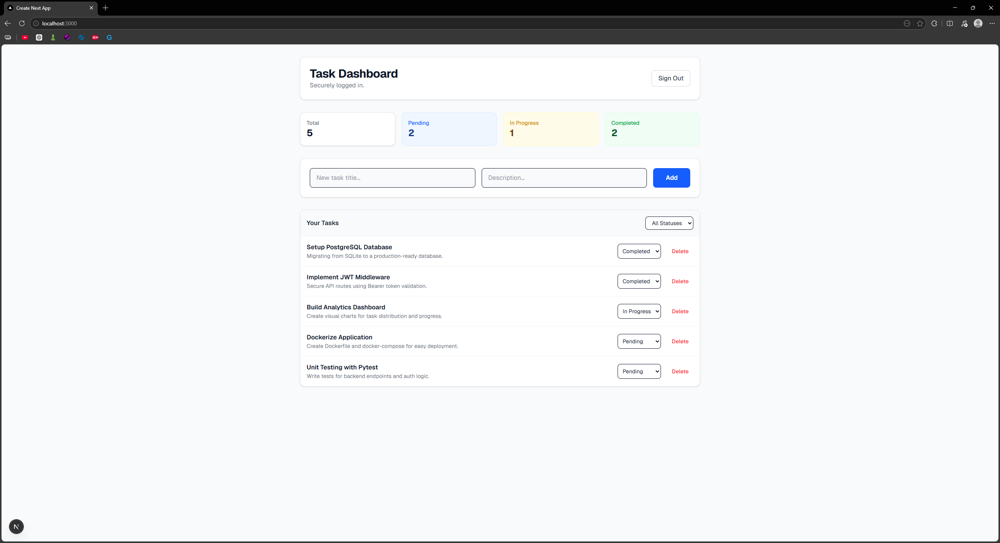
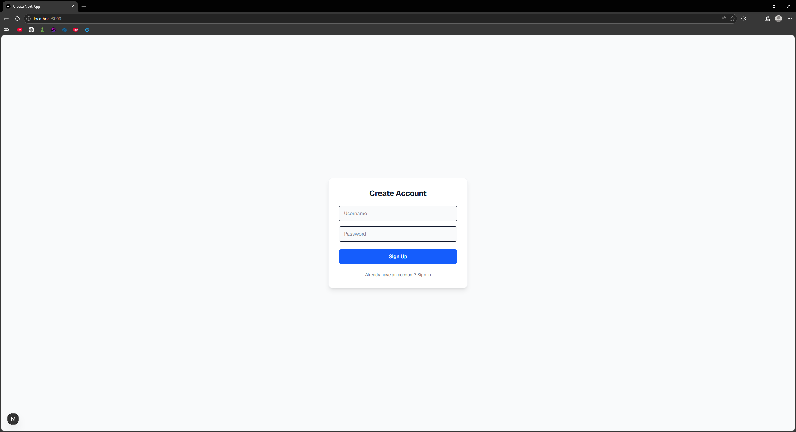

# 🚀 Fullstack Task Manager


A powerful, secure, and responsive project management dashboard. This application features a robust **FastAPI** backend and a modern **Next.js** frontend, providing a seamless experience for managing personal tasks.

---

## 📸 Application Previews

**Main Dashboard & Task Analytics**


**Secure User Authentication**


---

## ✨ Key Features

- **🔐 Secure JWT Authentication:** User accounts with hashed passwords and token-based sessions. Users only see and manage their own tasks.
- **📊 Real-time Task Summary:** Dynamic cards at the top of the dashboard provide an instant overview of total, pending, in-progress, and completed tasks.
- **⚡ Full CRUD Capability:** Create, read, update status, and delete tasks with instant UI updates.
- **🔍 Advanced Filtering:** Quickly filter your task list by status to stay focused on what matters.
- **🎨 Modern UI/UX:** Built with Tailwind CSS for a clean, professional, and responsive design.
- **📜 Interactive API Docs:** Built-in Swagger UI for testing backend endpoints.

---

## 🛠️ Technical Stack & Decisions

- **Frontend:** **Next.js (App Router)** + **Tailwind CSS**. *Decision: Chosen for superior performance, modern React patterns, and rapid UI development.*
- **Backend:** **Python** + **FastAPI**. *Decision: High-performance framework that offers automatic data validation and interactive documentation.*
- **Database:** **SQLite** with **SQLAlchemy ORM**. *Decision: Lightweight and efficient for development, requiring zero external setup.*
- **Security:** **Bcrypt** for password hashing and **PyJWT** for secure, stateless authentication.

---

## 🚦 Local Setup Instructions

### 1. Backend (FastAPI)
1. Navigate to the backend directory:
   ```bash
   cd backend
Create and activate a virtual environment:

Bash
python -m venv venv
# On Windows: .\venv\Scripts\activate
Install dependencies:

Bash
pip install fastapi uvicorn sqlalchemy pydantic pyjwt bcrypt python-multipart
Start the server:

Bash
uvicorn main:app --reload
2. Frontend (Next.js)
Open a new terminal and navigate to the frontend directory:

Bash
cd frontend
Install dependencies:

Bash
npm install
Start the development server:

Bash
npm run dev
🔮 Future Roadmap
[ ] Database Scaling: Migration to PostgreSQL for production environments.

[ ] Containerization: Implement Docker and docker-compose for easy deployment.

[ ] Cloud Hosting: Deploy the frontend to Vercel and the backend to Render.

[ ] Dark Mode: Add a theme toggle for enhanced user preference.

Contact
Meet Pawar - meet.pawar24@gmail.com

Project Link: https://github.com/MeetNotFound/Fullstack-Task-Manager